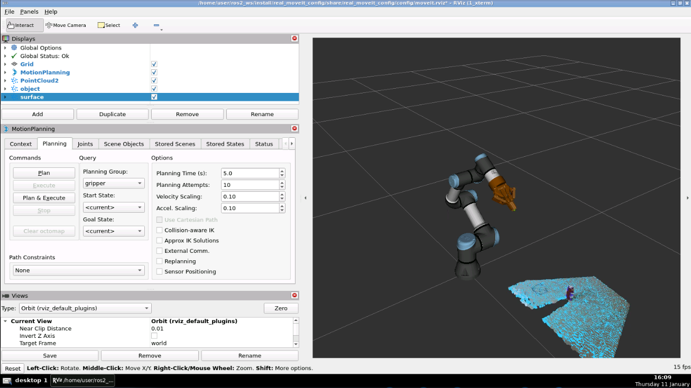
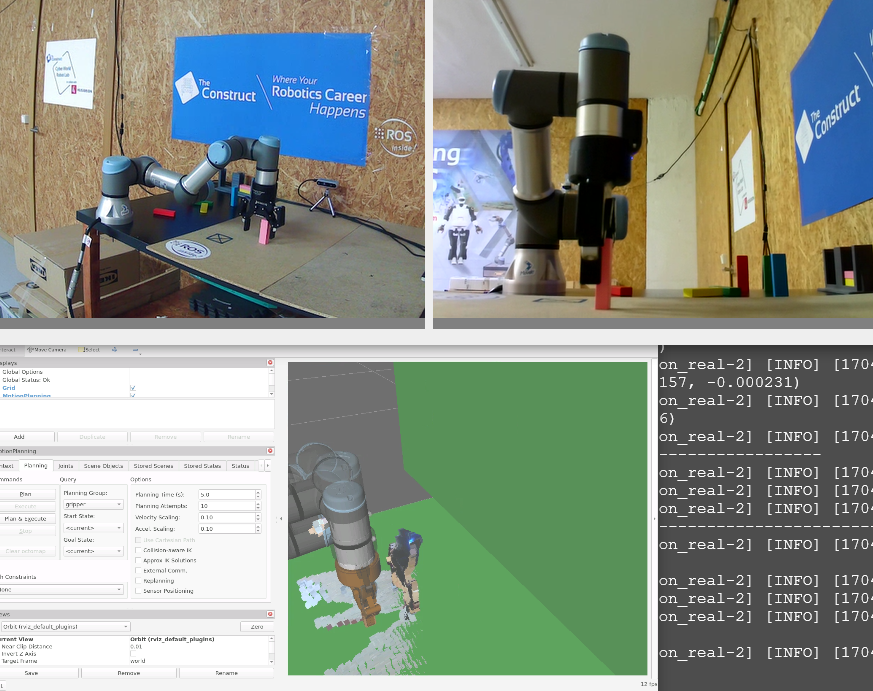
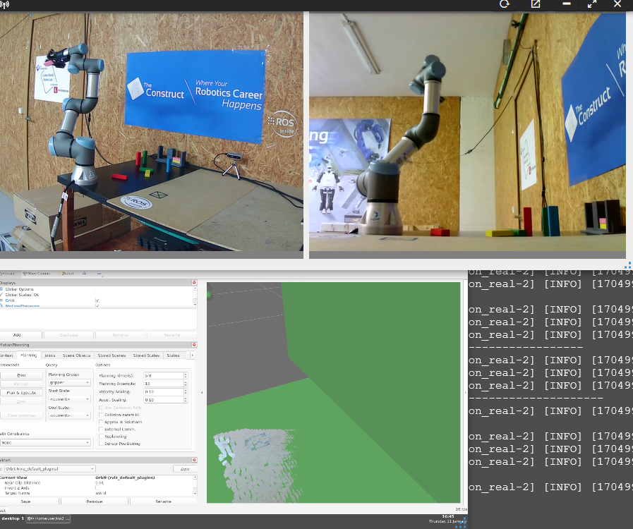

# manipulation_project
manipulation project with robot UR3e


https://github.com/Andy-Leo10/manipulation_project/assets/60716487/e5a08704-20b6-412d-92f0-49e8a993472b


## Run the simulation
```
source ~/ros2_ws/install/setup.bash
ros2 launch the_construct_office_gazebo warehouse_ur3e.launch.xml
```
Check if everything is correct
```
ros2 control list_controllers
ros2 topic echo /joint_states
```

## Launch most importants nodes v.FK
+ Move Group
```
ros2 launch my_moveit_config move_group.launch.py use_sim_time:=True
ros2 launch real_moveit_config move_group.launch.py use_sim_time:=False
```
+ Robot Interface 
```
ros2 launch my_moveit_config moveit_rviz.launch.py
ros2 launch real_moveit_config moveit_rviz.launch.py
```
+ Custom Task: Pick & Place
```
ros2 launch moveit2_scripts pick_and_place.launch.py use_sim_time:=True
ros2 launch moveit2_scripts pick_and_place.launch.py use_sim_time:=False
```

## Launch most importants nodes v.IK&Perception
+ Move Group
```
ros2 launch my_moveit_config move_group.launch.py use_sim_time:=True
ros2 launch real_moveit_config move_group.launch.py use_sim_time:=False
```
+ Robot Interface 
```
ros2 launch my_moveit_config moveit_rviz.launch.py
ros2 launch real_moveit_config moveit_rviz.launch.py
```
+ Custom Task: Pick & Place
```
ros2 launch moveit2_scripts pick_and_place_perception.launch.py
ros2 launch moveit2_scripts pick_and_place_perception_real.launch.py
```

## Test Perception 
+ Start the action 
```
ros2 run simple_grasping basic_grasping_perception_node --ros-args -p debug_topics:=true
ros2 run simple_grasping basic_grasping_perception_node_real --ros-args -p debug_topics:=true
```
+ Call the action 
```
ros2 action send_goal /find_objects grasping_msgs/action/FindGraspableObjects "{plan_grasps: false}"
```

## Others
GUI for arms
```
sudo apt-get update
sudo apt-get install ros-humble-rqt-joint-trajectory-controller
ros2 run rqt_joint_trajectory_controller rqt_joint_trajectory_controller
```
URDF Tree 
```
ros2 run tf2_tools view_frames
```
Capture positions
```
ros2 topic echo /joint_states
ros2 run tf2_ros tf2_echo base_link tool0
```
Generate new cube in simulation
```
ros2 run gazebo_ros spawn_entity.py -file /home/user/ros2_ws/src/manipulation_project/grasp_box.urdf -x 5.28 -y -3.84 -z 1.0 -entity grasp_box_x
```

### Perception

### Pick

### Place
